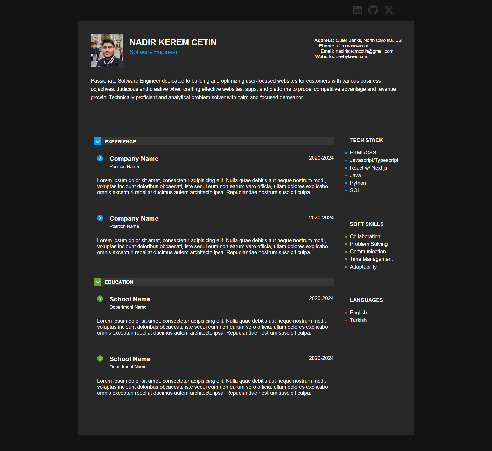

# Resume Built with HTML and CSS

This repository contains an assignment for the Per Scholas Software Engineering Program, focusing on creating a responsive resume using HTML and plain CSS. The design closely resembles an HTML page shown in the course materials.

## Features

- **Semantic HTML**: The resume is structured using semantic HTML for better accessibility and SEO.
- **Stylish Design**: Styled with CSS to create a visually appealing layout.
- **Responsive**: Designed to be responsive, ensuring compatibility with various devices.
- **Modern Design Practices**: Follows modern web design practices for a sleek look and feel.
- **Font Awesome Icons**: Includes Font Awesome icons for social media platforms to enhance visual elements.

## Technologies Used

- HTML5
- CSS3

## Live Site

[View Live Site](https://resume-html-css-mu.vercel.app/)

## Getting Started

To view the resume, simply open the `index.html` file in your web browser.

## Screenshot

